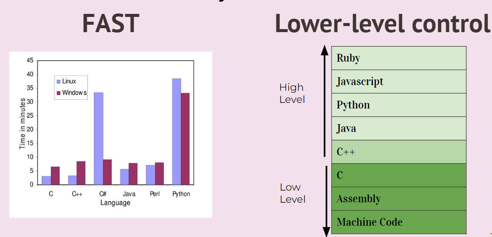
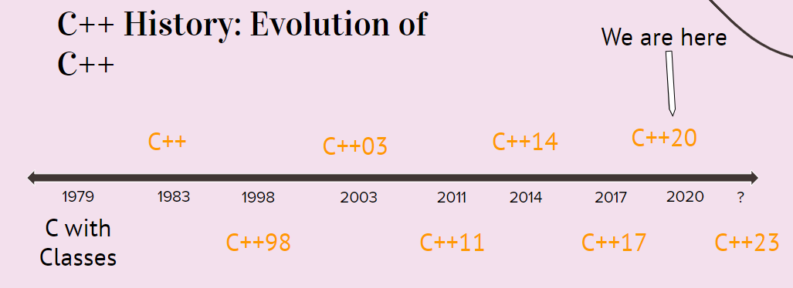
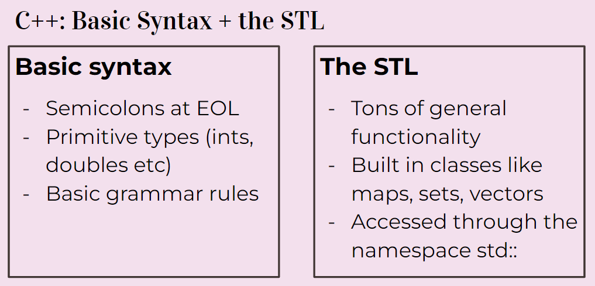
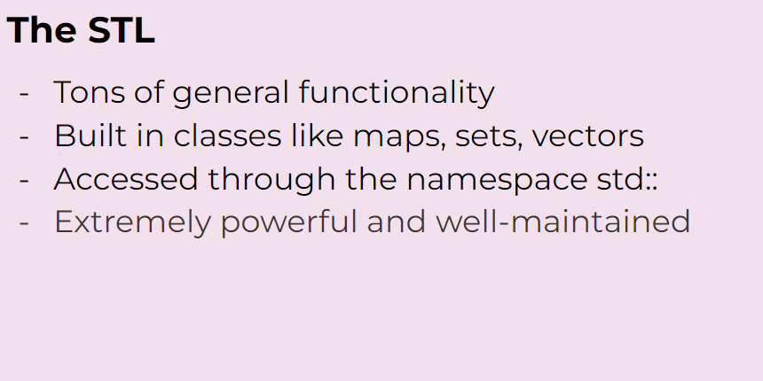

## 前言
>我第一次学习 C++应该是在大一下学期。那时候我买了一本《C++ Primer》来看，然而并没有看多少我就被紧张的课业压迫得丢下了课外书投入了本校课程的怀抱。然而熟悉中国大陆大学特点的人可能都知道，在课堂上能学到的东西微乎其微，并且那微乎其微的一点知识大概率也是过时的知识。我的 C++当时就只靠浙大翁恺的课程平安度过了，当时分数好像也不算低，应该也是班级前几名，但是可惜的是我依然觉得什么都没学会。
>恰好现在大三，金山办公来搞了个什么训练营，应该是让我们用 C++进行 QT 开发，我这是才突然回想起来，原来我 C++已经全部忘干净了，惭愧惭愧。恰好最近对计算机图形学感兴趣了起来，这种对性能要求比较高端领域一般都会要求 C++或者 C 来实现，所以恰好趁这个机会，我就根据 CS 106L 的 Slides 来慢慢复习一下 C++的内容。

## 为什么还要学习 C++呢？
就像标题所问的一样，C++没有 GC，内存管理也麻烦，模板也难看懂（IMHO），那为什么我们还要来学习 C++呢？
我们在 Tiobe Index, 2021 的排行中也可以看到，C++的排名还是很靠前的

这说明 C++依然是业界广泛运用的语言，依然拥有这巨大的影响力。
同时还有很多大公司依然在用 C++，很多出名的项目依然是使用 C++来完成的

这些公司或者项目选择 C++的原因很多是因为——快、底层控制。


## C++到底是什么？
### 一些 C++代码
```c++
#include <iostream>  
int main() {  
	std::cout << "Hello, world!" << std::endl;  
	return 0;  
}
```
### 同样也是 C++代码
```c++
#include "stdio.h"  
#include "stdlib.h"  
int main(int argc, char *argv) {  
	printf("%s", "Hello, world!\n");  
	// ^a C function!  
	return EXIT_SUCCESS;
}
```
### 这其实也是 C++代码
```c++
#include "stdio.h"  
#include "stdlib.h"  
int main(int argc, char *argv) {  
	asm( "sub $0x20,%rsp\n\t" // assembly code!  
		"movabs $0x77202c6f6c6c6548,%rax\n\t"  
		"mov %rax,(%rsp)\n\t"  
		"movl $0x646c726f, 0x8(%rsp)\n\t"  
		"movw $0x21, 0xc(%rsp)\n\t"  
		"movb $0x0,0xd(%rsp)\n\t"  
		"leaq (%rsp),%rax\n\t"  
		"mov %rax,%rdi\n\t"  
		"call __Z6myputsPc\n\t"  
		"add $0x20, %rsp\n\t"  
	);  
	return EXIT_SUCCESS;
}
```
C++是一个很神奇的语言，他没有限制程序员该用什么风格来写代码，也给了程序员极大的自由，你甚至可以在 C++代码中嵌入汇编代码（如果你真的需要的话...）。

## C++的历史由来
在计算机发展的早期，人们通过在卡片上打孔来进行编程，后来人们为了方便，便发明了汇编语言：
```assembly
section .text  
global _start ;must be declared for linker (ld)  
_start: ;tell linker entry point  
mov edx,len ;message length  
mov ecx,msg ;message to write  
mov ebx,1 ;file descriptor (stdout)  
mov eax,4 ;system call number (sys_write)  
int 0x80 ;call kernel  
mov eax,1 ;system call number (sys_exit)  
int 0x80 ;call kernel  
section .data  
msg db 'Hello, world!',0xa ;our dear string  
len equ $ - msg ;length of our dear string
```
汇编语言有以下几个特点：
- 有着极其简单直接的指令。
- 执行起来非常快（如果汇编程序写得好的话）
- 可以完全掌控你的程序
听起来不错吧，但是后来我们依然抛弃了汇编语言，现在除了一些特殊场景，几乎没有人会日常使用汇编语言来进行编程。因为汇编语言除了有上面几个好处外，还有几个致命的缺点：
- 为了一个简单的任务需要编写非常多的代码
- 非常的难以理解汇编代码
- 程序几乎不可以移植（进程几乎不可以跨系统/平台执行）
后来贝尔实验室的大佬们就发明了 C！
因为实际上计算机仅仅能理解汇编语言，那么 C 是怎么解决上面的问题的呢？
- 源代码可以通过更符合人类直觉的语言来编写
- 通过额外的程序来将源代码转换成汇编代码
	- 这个额外的程序就是**编译器**
	- 编译原理就是讲这一块的
	Ken Thompson 和 Dennis Ritchie 在 1972 年创造了 C 语言，使用 C 的话很容易就能实现跨平台。但是 C 也有一些缺点：
- C 没有对象或者类
- 很难写出泛型代码
- 编写大型程序时比较麻烦
所以 Bjarne Stroustrup 在 1983 年创造了 C++，他希望 C++能比 C 多出来的优势是加上了一些高级的特性。


C++的设计哲学：
- 只提供能解决实际问题的特性
- 程序员应该能自由地选择编程风格
- 允许程序员掌控所有东西（如果他想的话）
- 非必要不牺牲性能
- 在编译时就尽量保证安全
## 那么到底什么是 C++
C++可以理解成就是基本的**语言语法**加上**STL**：

